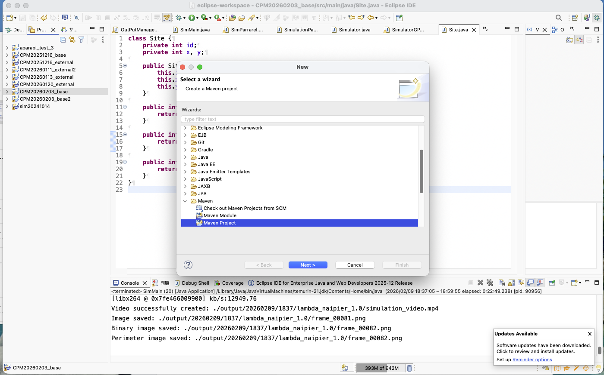
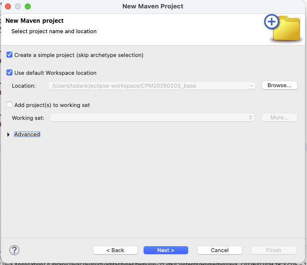
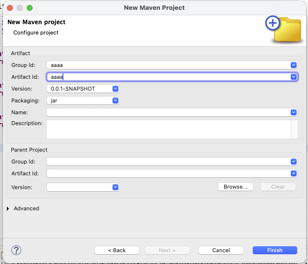
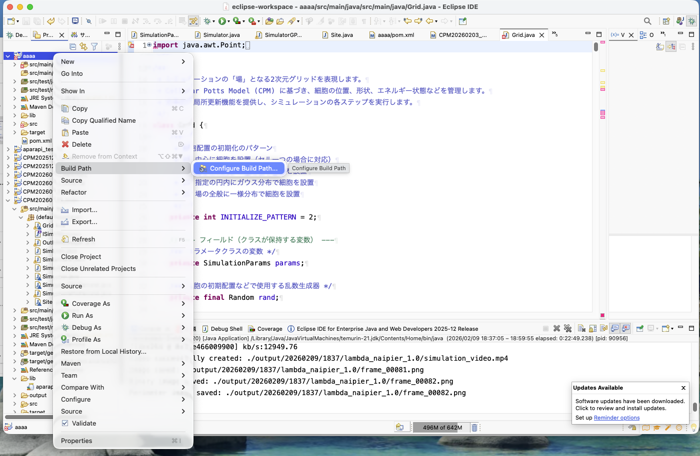
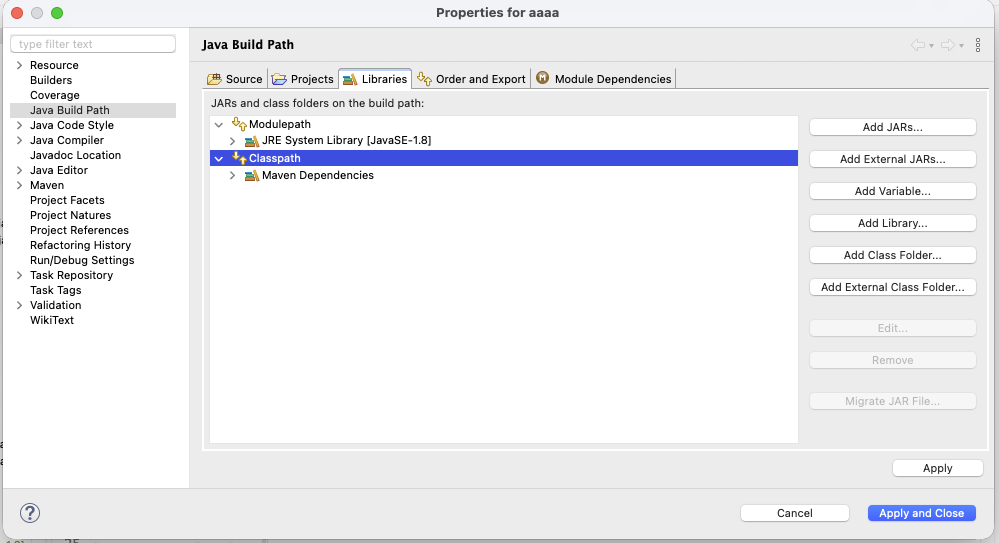
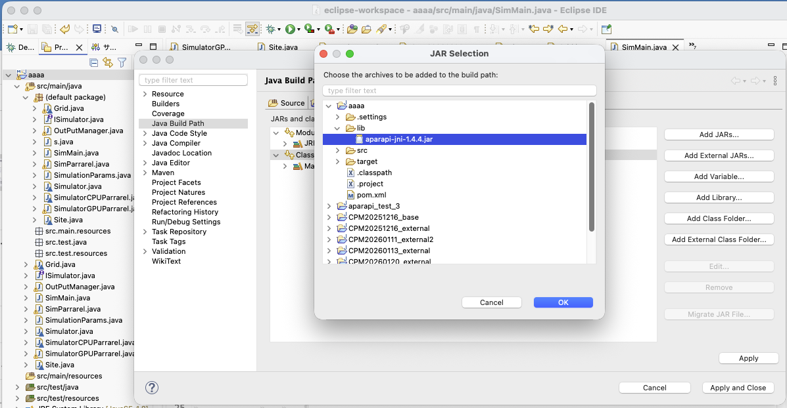
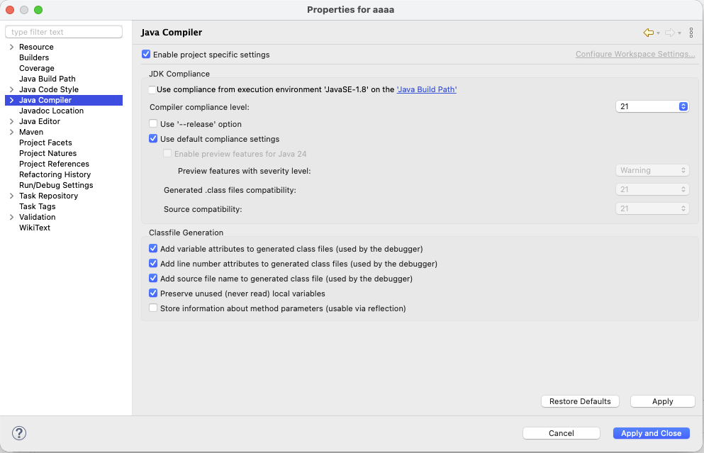

# Cellular Potts Model (CPM) シミュレーション 利用マニュアル

## 1. 概要
本プログラムは、Cellular Potts Model (CPM) に基づき、細胞の位置・形状・細胞間接着などのエネルギー状態を計算し、2次元グリッド上で細胞の動態をシミュレーションするシステムです。
CPUによる標準実行のほか、Aparapiライブラリを用いたGPGPUによる高速な並列計算（ハイブリッドモデル）に対応しており、複数の乱数シードを用いたシミュレーションをマルチスレッドで並行して実行できます。

## 2. セッティング

本モデルはJava言語を用いて構築されています。統合開発環境としてEclipseを使用しています。環境はMacBook Pro M2を想定しています。他環境において検証は行なっていません。

本モデルの構築手順は以下の通りです。

1. EclipseにてMaven形式のプロジェクトファイルを作成する。



aaaaとなっている部分は自由です。わかりやすい形にしてください。
1. GitHubからダウンロードした各ファイルを適当な位置に格納する。
    * libはプロジェクトファイルに直接格納する
    * ソースファイルは作成したMavenプロジェクト内のsrc/main/java内にパッケージを作成し、その中に入れる。（または適当なクラスを作成した時に生成されるdefault packageに入れる）
    * pom.xmlファイルはプロジェクトファイル内にすでに存在しているため、こちらに中身だけコピペする。この際、  ```\<groupId>(プロジェクト作成時に指定したgroupId)\</groupId> ```および
    ```\<artifactId>(プロジェクト作成時に指定したartifactId)\</artifactId>```だけはプロジェクトファイルに依存するので書き換えましょう。
    *(targetファイルは無視してください。必要ありませんでした)
1. プロジェクトに対してaparapi-jni-1.4.4.jarのビルドパスを適用する。


Add JARsを選択

lib内のaparapi-jni-1.4.4.jarを選択
1.JavaCompilarからCompiler compliance levelを21にする。(17以上であれば大丈夫です。17未満の場合、モデルで使用しているrecordが使用できないため、コードを書き換えていただく必要があります)


## 3. プログラムの実行と基本設定

シミュレーションの実行は `SimMain` クラスから開始します。

* **並列実行:**
  実行マシンの利用可能なコア数を自動取得し、設定された乱数シードの配列（`seedList`）に基づいて、複数パターンのシミュレーションを並行して実行します。
* **動作モードの切り替え (`SimParrarel` クラス):**
  以下のフラグ変数を変更することで、動作モードを切り替えます。
  * `USE_GPU` (true/false): `true` の場合、Aparapiを使用したGPUモード（`SimulatorGPUParrarel`）で実行されます。`false` の場合はCPUモード（`Simulator`）になります。
  * `MAKE_MOVIE` (true/false): `true` に設定すると、シミュレーション過程の画像を保存し、終了時にFFmpegを利用して動画（mp4）を生成します。

## 4. シミュレーションパラメータ (`SimulationParams`)

シミュレーションの各種条件は `SimulationParams` クラスで設定します。スレッドごとに独立してインスタンス化されるため、並列実行時も安全に値を変更できます。

| パラメータ名 | 説明 | デフォルト値 |
| :--- | :--- | :--- |
| `GRID_WIDTH` / `GRID_HEIGHT` | 空間の幅と高さ（ピクセル数） | 1000 x 1000 |
| `NUM_CELLS` | 配置する細胞の数（背景を含むため実際の細胞数+1） | 101 |
| `SIMULATION_MCS` | 実行するモンテカルロステップ（MCS）の総数 | 100 |
| `RAND_SEED` | 乱数生成のシード値 | 0 |
| `CELL_SIZE` | 画像出力時の1セルの描画サイズ | 5 |
| `TARGET_AREA` | 細胞の目標面積 | 120 |
| `TARGET_PERIMETER` | 細胞の目標周囲長 | 70 |
| `K_AREA` | 面積制約の強度 | 5.0 |
| `K_PERI` | 周囲長制約の強度 | 5.0 |
| `TEMPERATURE` | シミュレーションの温度パラメータ（揺らぎの大きさ） | 10.0 |
| `J` | 細胞タイプ間の接着エネルギー行列 | `{ {0, 20}, {20, 80} }` |

## 4. 細胞の初期配置パターン (`Grid`)

`Grid` クラス内の `INITIALIZE_PATTERN` 変数で、シミュレーション開始時の細胞配置パターンを指定できます。

* **パターン 0:** 中心に細胞を1つだけ配置します（`NUM_CELLS` が1より大きい場合は警告が出ます）。
* **パターン 1:** 指定された円形領域内に、一様分布でランダムに細胞を配置します。
* **パターン 2:** 指定された円形領域内に、ガウス分布（正規分布）に従って細胞を配置します。
* **パターン 3:** グリッド全体（境界10ピクセルを除く）に、一様分布でランダムに細胞を配置します。

## 5. 出力データ (`OutputManager`)

シミュレーション結果は、実行日時に基づくタイムスタンプ付きフォルダ（例: `output/YYYYMMDD/HHmm/random_seed_X`）に自動的に保存されます。

* **パラメータログ (`parameters_*.txt`):** 実行に使用された `SimulationParams` の内容が保存されます。
* **CSVデータ (`cell_data.csv`):** 各ステップにおける総エネルギー、遷移回数、および各細胞の面積・周囲長・接触エネルギーが記録されます。
* **画像出力 (`frame_*.png`):** シミュレーション空間の可視化画像です。細胞IDに応じて色が割り当てられます。
* **境界画像:** 細胞の境界ピクセルのみを黒色、その他を白色で描画した二値画像が出力されます。
* **動画ファイル (`simulation_video.mp4`):** `MAKE_MOVIE` が `true` の場合、保存された連番画像からFFmpegを用いて生成されます（※実行環境にFFmpegのインストールとパス設定が必要です）。
* **実行時間レポート (`execution_time.txt`):** シミュレーションの開始時刻、終了時刻、および総実行時間（秒）が記録されます。